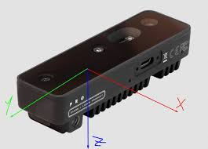
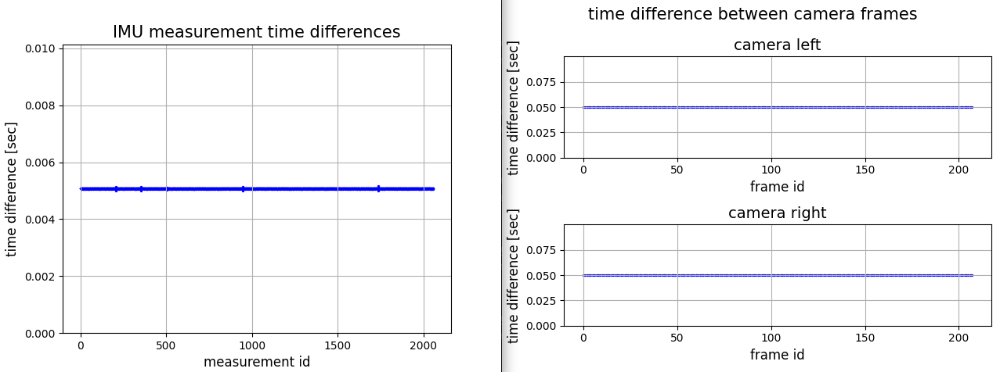
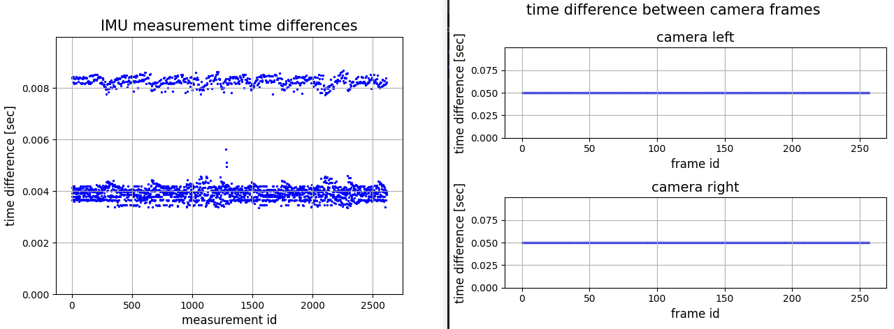

# OAK Calibration Utilities
This repo contains recording and calibration tools for OAK cameras.

 

We usually use [opencv calibration](https://docs.opencv.org/4.x/dc/dbb/tutorial_py_calibration.html) and the [Kalibr toolbox](https://github.com/ethz-asl/kalibr) for calibrating out OAKD sets.
Refer to the relevant documentation for further details on camera and IMU calibration procedures.

# Setup

----
install python 3.10+

install python packages according to [requirements.txt](./requirements.txt)

connect OAKD using usb

# Usage

----
This repo enables to record, analyse and calibrate OAKD camera sets.
We support:
- camera intrinsic calibration
- camera stereo calibration
- visual-inertial calibration

## 0) OAK Operation Sanity Check

Demo scripts display OAKD sensor readings online to check that everything is working correctly.

- [demo_OAKD_cameras.py](./demo_OAKD_cameras.py) - demo for setting up the cameras, and watch camera images in realtime. 
- [demo_OAKD_imu.py](./demo_OAKD_imu.py) - demo for setting up the imu, and watch IMU data in realtime.
- [demo_OAKD_stereo_depth.py](./demo_OAKD_stereo_depth.py) - demo for setting up cameras and depth estimation, and watching in realtime.
 
  

## 1) Record Sensors Data 

Record utilities help record sensors for calibration. Typically different calibrations require different ways of recording the sensors data:
- Camera intrinsics and stereo calibration typically require snapshots 
- Visual-Inertial calibration typically requires continuous and synchronized camera and IMU data.  
- IMU noise parameters calibration typically requires continuous IMU data.

The various scripts enable recording sensors separately or together, and recording camera frames continuously or as snapshots:

1. [record_OAKD_cameras.py](./record_OAKD_cameras.py) - record camera images in two modes:
   - snapshot: display images continuously, but save images when pressing the keyboard space.
   - video: continuously display and save images. start / stop using the "V" key.
  
    both modes can be operated together\
    snapshot mode is **typically used for intrinsic \ stereo calibration**  

2. [record_OAKD_stereo-inertial.py](./record_OAKD_stereo-inertial.py) - continuously display and record imu and cameras.
  
    This script is **typically used for visual-inertial calibration**

3. [record_OAKD_imu.py](./record_OAKD_imu.py) - continuously display and record imu measurements.
    This script is typically used for IMU noise parameters calibration. 

## 2) Verify Record Validity

After recording visual-inertial, use [record_OAK_analizer.py](./record_OAK_handler.py) to test recording.

One should look at:
- camera frame rate
- camera frames time differences consistency
- stereo cameras frame matching
- imu rate
- imu time differences consistency

Make sure measurement rates, and timing consistency are good enough for calibration. 

## 3) Cameras and IMU Calibration

This repo includes camera calibration scripts for calibrating camera intrinsics / stereo params / camera-imu. Along side these scripts you can find [calibration record examples](./examples/calibration_example) that can be used to try the different types of calibration. While these examples are reduced to save repo space, they are enough to demonstrate all calibration processes.

These examples were recorded using the utils in this repo, and an OAKD-S2 device, and include:
- [left camera intrinsic calibration record](./examples/calibration_example/intrinsic_calibration_left): sanpshot images with [640x400] resolution.
- [right camera intrinsic calibration record](./examples/calibration_example/intrinsic_calibration_right): sanpshot images with [640x400] resolution.
- [stereo camera calibration record](./examples/calibration_example/stereo_calibration): sanpshot images with [640x400] resolution.
- [camera-imu calibration record](./examples/calibration_example/camera_imu_calibration): cameras were set to [640x400] resolution and recorded at 20fps. IMU was recorded at 250Hz accelerometer and 200Hz gyroscope.  

One cane practice using the calibration utils in this repo for intrinsic / stereo / camera-imu calibration with these examples.  

### camera intrinsics calibration

To calibrate camera intrinsics and stereo parameters:
1. Take snapshot images of calibration board using [record_OAKD_cameras.py](./record_OAKD_cameras.py).
2. calibrate camera intrinsics with the [camera intrinsic calibration](./camera_intrinsic_calibration.py) script (based on [opencv calibration](https://docs.opencv.org/4.x/dc/dbb/tutorial_py_calibration.html)).

You can try to calibrate the [left camera intrinsic calibration example](./examples/calibration_example/intrinsic_calibration_left) or [right camera intrinsic calibration example](./examples/calibration_example/intrinsic_calibration_right).

    python ./camera_intrinsic_calibration.py --images_dir ./examples/intrinsic_calibration_left/left/ --output_dir ./examples/intrinsic_calibration_left/ --calibration_board_file ./examples/intrinsic_calibration_left/calibration_chessboard.yaml --camera_name left
    python ./camera_intrinsic_calibration.py --images_dir ./examples/intrinsic_calibration_right/right/ --output_dir ./examples/intrinsic_calibration_right/ --calibration_board_file ./examples/intrinsic_calibration_right/calibration_chessboard.yaml --camera_name right
The script waits for you to close figures.

### stereo calibration

To calibrate stereo cameras parameters:
1. Take stereo snapshot images of calibration board using [record_OAKD_cameras.py](./record_OAKD_cameras.py).
2. calibrate stereo parameters with the [stereo camera calibration](./camera_stereo_calibration.py) script (based on [opencv calibration](https://docs.opencv.org/4.x/dc/dbb/tutorial_py_calibration.html)).

You can try the calibration script with [stereo calibration example](./examples/calibration_example/stereo_calibration).

    python ./camera_stereo_calibration.py --left_images_folder ./examples/stereo_calibration/stereo/left/ --right_images_folder ./examples/stereo_calibration/stereo/right/ --output_dir ./results/stereo_calibration/ --calibration_board_file ./examples/stereo_calibration/calibration_chessboard.yaml --intrinsic_file_left ./examples/stereo_calibration/camera_intrinsics_left.yaml  --intrinsic_file_right ./examples/stereo_calibration/camera_intrinsics_right.yaml 

The script waits for you to close figures.

### visual-inertial with kalibr

For visual-inertial calibration we use the [Kalibr toolbox](https://github.com/ethz-asl/kalibr). 
1. Visual-inertial calibration requires a continuous and synchronized record of camera images and IMU data where cameras watch a calibration board and undergo complex motion. This record can be taken with [record_OAKD_stereo-inertial.py](./record_OAKD_stereo-inertial.py).
2. Use [record_OAK_handler.py](./record_OAK_handler.py) to test record rates and stability.
   - make sure camera rate is stable at 20Hz 
   - make sure imu rate is stable at 200Hz
3. save record in Kalibr bag format using the `camera_calibration_utils.save_record_to_bag` function.

   You can try record analysis, and saving kalibr bag for the camera-imu calibration example with:

       python record_OAK_handler.py

   The script waits for you to close figures. 

4. calibrate with kalibr
 
       source ~/kalibr_workspace/devel/setup.bash
       cd ~/kalibr_workspace/
       rosrun kalibr kalibr_calibrate_imu_camera --target {} --imu {} --imu-models {} --cam {} --bag {}

    add ` --show-extraction` of you want to see corner detection

You can try camera-imu calibration with [camera-imu calibration example](./examples/calibration_example/camera_imu_calibration).

### camera intrinsics / stereo with Kalibr 

Intrinsic camera parameters and stereo parameters can also be calibrated using Kalibr. Serious dudes or dudettes might prefere Kalibr, or compare Kalibr calibration to opencv calibration.

To calibrate camera intrinsics and stereo parameters:
1. Take snapshot images of calibration board using [record_OAKD_cameras.py](./record_OAKD_cameras.py).
2. save images in Kalibr bag format using the `camera_calibration_utils.save_record_to_bag` method. 
   
   Note: In this case no `timestamps.txt` file is needed! arbitrary timestamps will be used.

3. calibrate with kalibr
 
       source ~/kalibr_workspace/devel/setup.bash
       cd ~/kalibr_workspace/
       rosrun kalibr kalibr_calibrate_cameras --bag {} --topics

    add ` --show-extraction` of you want to see corner detection

# Notes On OAKD Calibration

----

OAKD has some very good qualities which enables good intrinsic / stereo / camera-IMU calibrations. Some of the relevant attributes of the OAKD sensor system are:
- good camera-camera and camera-imu time synchronization
- low camera distortions
- global shutter cameras

We have successfully calibrated OAKD-Kite and OAKD-S2 for intrinsic, stereo and camera-imu.

There is, however, an issue with IMU packet times which is relevant for camera-imu calibration! Camera-imu calibration with Kalibr requires 20Hz camera frames and 200Hz IMU data.

In both OAKD-Lite and OAK-S2 the driver can only transfer one package at a time. This means that IMU data is delayed when camera frames are read. This problem is bypassed when using a buffer. ince calibration is offline, the delay is irrelevant as long as the timestamps are correct. It also seems OK when using OAKD in realtime with SLAM packages.

In both OAKD-Lite and OAK-S2 gyro and acc each can be configured to a different discrete set of frequencies (see [luxonis imu documentation](https://docs.luxonis.com/software/depthai-components/nodes/imu)). 

In OAKD-lite acc and gyro can be both set to 200Hz. Under this configuration IMU packet timestamps are received in stable frequency, which gives good conditions for camera-imu calibration. 

In OAKD-S2 acc and gyro do not have a common frequency. This configuration results in IMU packets misses. The driver sensd IMU messages in the higher frequency, but once in a while misses a packet since the slower sensor does not generate data fast enough. This unstable behaviour of the IMU is ***not optimal for IMU-camera calibration***. While we did succeed in camera-imu calibration, results quality might be compromised.

